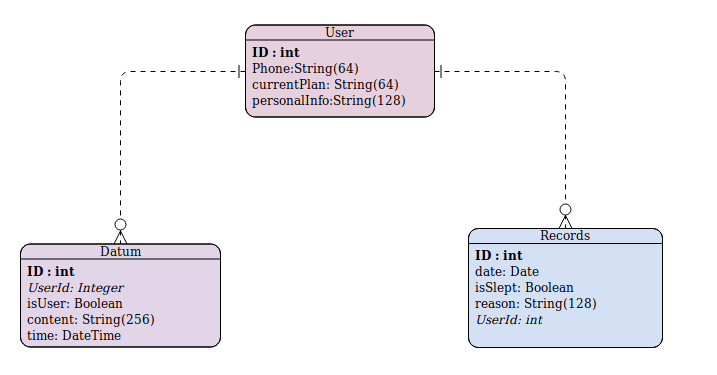

# Database sever for Magic Butler

database sever for Sleep reminder chat bot, Magic Butler

## Quickstart

### Local development

This project is built using the Flask web framework. It runs on Python 3.4+.

To run the sever locally follow these steps:

1. Clone this repository and `cd` into `database_sever` folder.

1. Create a new virtual environment and activate it :

    ``
    python3 -m venv venv``

    ``source venv/bin/activate
    ``

1. Install the requirements.

    ``
    pip install -r requirements.txt
    ``

1. Initial the database.

    ``
    python3 manage.py db init
    ``

1. Run the migration.

    ``
    python3 manage.py db migrate -m "initial migration"``

    ``python3 manage.py db upgrade
    ``

1. Start the database server.

    ``
    python3 manage.py runserver -p [portnum]
    ``

## Database Overview

### Database Structure

### Sever API

1. For User Table:
	- Search (request method: GET)
		- http://localhost:port/users: return all users
		-  http://localhost:port/user/id/[idnum]: return user by id
		-  http://localhost:port/user/phone/[phonenum]: return user by phone
	- Create (request method: POST)
		- http://localhost:port/user:  request body's example is in example folder 
	- Delete
		- http://localhost:port/user/[idnum]: Delete user by ID
	- Update
		- http://localhost:port/user/[idnum]: Update user by ID with all columns
		- http://localhost:port/user/[idnum]/hit++
		- http://localhost:port/user/[idnum]/hit--
		- http://localhost:port/user/[idnum]/miss++
		- http://localhost:port/user/[idnum]/miss--
		- http://localhost:port/user/[idnum]/missreset
		- http://localhost:port/user/[idnum]/hitreset
		- http://localhost:port/user/[idnum]/changeplan
		- http://localhost:port/user/[idnum]/update: Update user with selected columns
	
2. For Record Table:
	- Search (request method: GET)
		- http://localhost:port/records: return all records
		- http://localhost:port/record/id/[idnum]: return record by id
	- Create (request method: POST)
		- http://localhost:port/record:  request body's example is in example folder 
	- Delete (request method: DELETE)
		- http://localhost:port/record/[idnum]: Delete record by ID
	- Update (request method: PUT)
		- http://localhost:port/record/[idnum]: Update record by ID
		- http://localhost:port/record/[idnum]/update: 
	
3. For Plan Table:
	
	- Search (request method: GET)
	  - http://localhost:port/plans: return all plans
	  - http://localhost:port/record/id/[idnum]: return plan by id
	- Create (request method: POST)
	  - http://localhost:port/plan:  request body's example is in example folder 
	- Delete (request method: DELETE)
	  - http://localhost:port/plan/[idnum]: Delete plan by ID
	- Update (request method: PUT)
	  - http://localhost:port/plan/[idnum]: Update plan by ID
	
4. For Datum Table:

   - Search (request method: GET)
     - http://localhost:port/data: return all raw data
     - http://localhost:port/datum/id/[idnum]: return datum by id

   - Create (request method: POST)
     - http://localhost:port/datum:  request body's example is in example folder 

   - Delete (request method: DELETE)
     - http://localhost:port/datum/[idnum]: Delete datum by ID

   - Update (request method: PUT)
     - http://localhost:port/datum/[idnum]: Update datum by ID

5. For Admin Table:

   - Get (request method: GET)
     - http://localhost:port/admin/get: return admin name and password

   - Create (request method: POST)
     - http://localhost:port/admin/create:  request body's example is in example folder 

   - Update (request method: PUT)
     - http://localhost:port/admin/update

6. For Analysis:
   - Get Top 3 reason (request method: GET) 
     - http://localhost:port/user/id/[idnum]/reason